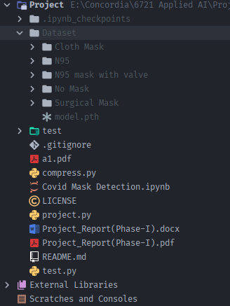

# AI_Covid_Mask_Detection

Directory Structure : 

Project Files:

1. model.pth :- Trained Model present in Dataset directory.
2. Project.py :- This file contains code to train and generate a model.
3. Test.py :- This file contains code to test the generated model on images present in test directory.
4. compress.py :- This file contains code to compress the unfiltered images in order to reduce their size while saving enough quality to train our model 
5. Project_Report(Phase-I).pdf :- The report for the project phase 1.
6. Expectation of originality form.

Link for the dataset (training data) : [Model](https://drive.google.com/file/d/11GxXPnrqInHe7Sgs3L9PqXF9k-_1_mbI/view?usp=sharing) [Dataset](https://drive.google.com/drive/folders/1dHMTfi06zapSD5Q10smseDc_ayUVVsTy?usp=sharing)

To start the training follow these steps :-

Project.py :-  
The master file that contains all the necessary methods in order to load the dataset, train the model, testing the performance 
and for making changes in order to load dataset from any different location and also the information regarding saving the model and it's location. 
Run the main function and it will start calling the methods to load the dataset, transform it, train it and test it on the test dataset.

After completing the training the evaluation can be performed by the displaying the confusion matrix and classification report as well as plotting the graph for loss
and accuracy. 

Test.py:- This file contains code to test the generated model on new untrained and untested images present in test directory. It will generate the output with image name and predicted class name.
To test on new images add them to test directory. 

